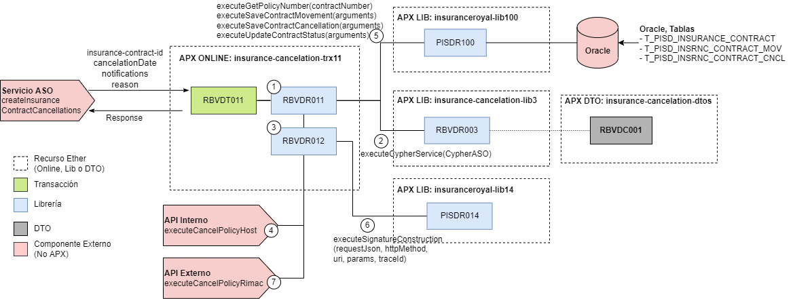

# 
# Recurso APX Online: insurance-cancelation-trx11

El objetivo de este documento es proveer informacion relacionada a las transacciones online dentro de este recurso que ha sido implementado sobre la Arquitectura APX y desplegado a traves de la Consola Ether.

## 1. Transacciones
En este apartado se detallan todas las transacciones implementadas.

### 1.1. Transaccion RBVDT011
  - Descripcion: Transacción que permite ejecutar una cancelación de póliza
  - Tipo de Origen: Servicio de Negocio
  - API de Negocio: [createInsuranceContractCancellations](https://catalogs.platform.bbva.com/apicatalog/business/apis/apis-insurances-insurancescontracts/versions/global-1.20.0/resources/insurancescontractsapiinsurancescontractsinsurancecontractidcancellationsv1/)
  - SMC del Servicio ASO: [Documento](https://docs.google.com/spreadsheets/d/1EJoZMx0tT1aUatCptKDoV5Qcrc6gEI6kuyrkbmiumN4/edit#gid=1761826994)
  - Usuario Transaccional: ZG13001
  - Version: 01-PE
  - Respuestas:
    - Código de respuesta: Http Code: 200, Severity: OK
    - Código de Respuesta: Http Code: 400, Severity: ENR

## 2. DTOs
En este apartado se detallan todas las clases DTOs utilizadas en este recurso.

- **PISDC011**:
  - amazon:
	- **SignatureAWS**: Entidad AWS

- **RBVDC001**:
  - policycancellation:
	- **EntityOutPolicyCancellationDTO**: Entidad de salida final de la cancelación
	- **InputParametersPolicyCancellationDTO**: Entidad de entrada de la cancelación
  - aso:
	- policycancellation:
		- **PolicyCancellationASO**: Entidad de cancelación aso
	- cypher:
		- **CypherASO**: Entidad de datos de cifrado
  - bo:
    - **PolicyCancellationBO**: Entidad de cancelación de la aseguradora
    - **PolicyCancellationPayloadBO**: Entidad del cuerpo de la cancelación de la aseguradora
    - **ContratanteBO**: Entidad de contratante de la aseguradora
    - **InputRimacBO**: Entidad datos de entrada de la cancelación de la aseguradora
    - **PolizaBO**: Entidad de póliza de la aseguradora
  - commons:
    - **ContactDetailDTO**: Entidad de datos de contacto
    - **ExchangeRateDTO**: Entidad de cambio de divisa
    - **GenericAmountDTO**: Entidad de monto
    - **GenericContactDTO**: Entidad de contacto
    - **GenericIndicatorDTO**: Entidad de indicadores
    - **GenericStatusDTO**: Entidad de status
    - **NotificationsDTO**: Entidad de datos de contacto
  - utils:
    - **RBVDConstants**: Entidad Constantes
    - **RBVDErrors**: Entidad Errores
    - **RBVDProperties**: Entidad Propiedades

## 3. Librerías

### 3.1. Librerías Internas
En este apartado se detallan todas las librerías internas creadas para implementar la logica de negocio de las transacciones.

#### 3.1.1. Librería RBVDR011
Orientada a realizar la lógica de negocio de la transacción RBVDT011.

- **Método executePolicyCancellation(InputParametersPolicyCancellationDTO input)**: Método para mapear datos de salida de la transacción.
  - Avisos a retornar: -
  
### 3.2. Librerías Externas
En este apartado se detallan las librebrias externas que hace uso esta aplicacion para acceder a fuentes de terceros.
- 
- **Librería PISDR311**: [Ver documentaction](https://globaldevtools.bbva.com/bitbucket/projects/PE_RBVD_APP-ID-105529_DSG/repos/lib_insurance_cancellation/browse/doc/DOC.md?at=refs%2Fheads%2Frelease%2F0.10)
  - Metodos reutilizados: executeCancelPolicyRimac(), executeSimulateCancelationRimac().
- **Librería PISDR100**: [Ver documentaction](https://globaldevtools.bbva.com/bitbucket/projects/PE_PISD_APP-ID-26197_DSG/repos/insuranceroyal-lib100/browse/doc/PISD_APX_Library_PISDR100.md?at=refs%2Fheads%2Frelease%2F0.5)
  - Metodos reutilizados: executeGetPolicyNumber(), executeSaveContractMovement(), executeSaveContractCancellation(), executeUpdateContractStatus().
- **Librería RBVDR003**: [Ver documentaction](https://globaldevtools.bbva.com/bitbucket/projects/PE_RBVD_APP-ID-105529_DSG/repos/insurance-cancelation-lib3/browse/doc/RBVD_APX_Library_RBVDR003.md?at=refs%2Fheads%2Frelease%2F0.2)
  -  Metodos reutilizados: executeCypherService().

## 4. Mensajes de Error y Avisos
En este apartado se detallan los distintos mensajes de error que retornan las librerías de acuerdo a los casos y logica de negocio implementada.

- **Advise RBVD00000102**: Código de producto o Número de póliza no válido.
- **Advise RBVD00000107**: Número de contrato no válido.
- **Advise RBVD00000110**: No se pudo realizar una conexión con el servicio de cifrado ASO.
- **Advise RBVD00000126**: El código de producto debe ser numérico.
- **Advise RBVD00000127**: El código de producto debe tener 4 caracteres como máximo.
- **Advise RBVD00000133**: Motivo de cancelación no válido.
- **Advise RBVD00000135**: Error al consultar el servicio de cancelación de póliza Host.
- **Advise RBVD00000139**: La póliza ya se encontraba anulada o cancelada.
- **Advise RBVD00000143**: La póliza no existe o no está formalizada.
- **Advise RBVD00000144**: La fecha de cancelación excede la covertura de la póliza.
- **Advise RBVD00000145**: Producto no apto para cancelación de póliza.
- **Advise RBVD00000146**: La póliza no se puede anular.

## 5. Diagrama de Componentes
En este apartado se grafican todos los componentes involucrados en el funcionamiento del recurso.

## 6. Versiones del Componente
En este apartado se detalla un historial de cambios o *changelog* por cada version implementada del recurso.

- **Versión 0.5.1**: Esta versión le permite al cliente ejecutar la cancelación de su póliza.
- **Versión 0.7.3**: Esta versión le permite al cliente ejecutar la cancelación de su póliza con endoso activo.
